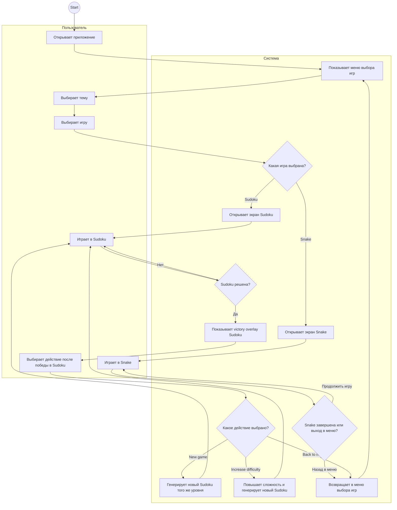

# Спецификация проекта `codexTest`

## 1. Назначение проекта

`codexTest` — это браузерный мини-аркадный сборник на чистом JavaScript без сторонних UI-фреймворков. Проект включает:

- клиентскую часть с экраном выбора между `Snake` и `Sudoku`;
- модули игровой логики с чистыми функциями;
- минималистичный Node.js сервер для локальной раздачи статических файлов;
- набор автотестов для ключевых игровых правил.

## 2. Цели и ожидаемый результат

Проект должен позволять пользователю:

- открыть приложение в браузере через локальный HTTP-сервер;
- выбрать одну из двух игр на стартовом экране;
- играть в `Snake` с темами, звуком, скоростью и паузой;
- играть в `Sudoku`, выбирая сложность, заполняя клетки числами и завершая партию с экраном победы;
- возвращаться из любой игры в главное меню;
- запускать новые сессии без перезагрузки страницы.

## 3. Технологический стек

- `Node.js` с ESM-модулями
- нативный `node:http` для локального сервера
- HTML + CSS + Vanilla JavaScript
- Web Audio API для звуков и фоновой музыки в `Snake` и `Sudoku`
- встроенный `node:test` для тестирования

## 4. Структура проекта

```text
codexTest/
├── index.html
├── styles.css
├── server.js
├── package.json
├── src/
│   ├── main.js
│   ├── snakeLogic.js
│   └── sudokuLogic.js
├── test/
│   ├── snakeLogic.test.js
│   ├── snakeTailMovement.test.js
│   └── sudokuLogic.test.js
└── spec/
    └── project-spec.md
```

## 5. Архитектура

### 5.1. Клиентский слой

Файл `src/main.js` отвечает за:

- хранение состояния интерфейса, выбранной темы и активной игры;
- переключение между экраном выбора, `Snake` и `Sudoku`;
- запуск и остановку игрового цикла `Snake`;
- обработку клавиатуры, экранных кнопок и действий `Sudoku`;
- управление скоростью, звуком, темой и сложностью `Sudoku`;
- отрисовку игрового поля, сетки `Sudoku`, victory overlay и служебных статусов;
- воспроизведение звуковых эффектов и фоновой музыки для обеих игр.

### 5.2. Игровая логика Snake

Файл `src/snakeLogic.js` содержит чистые функции, которые не зависят от DOM:

- создание начального состояния;
- нормализацию направления движения;
- расчет следующего шага;
- перенос координат по краям поля;
- проверку столкновений;
- выбор новой позиции для еды.

### 5.3. Игровая логика Sudoku

Файл `src/sudokuLogic.js` содержит чистые функции для `Sudoku`:

- создание состояния новой партии;
- выбор уровня сложности;
- установку значений в редактируемые клетки;
- очистку одной клетки или всех пользовательских значений;
- вычисление конфликтов;
- определение текстового статуса партии;
- проверку полного решения;
- повышение уровня сложности после завершения партии.

### 5.4. Серверный слой

Файл `server.js` поднимает локальный HTTP-сервер и раздает статические файлы проекта из корневой директории.

## 6. Функциональные требования

### 6.1. Меню выбора игры

- При первичной загрузке должен показываться экран выбора между `Snake` и `Sudoku`.
- Пользователь должен иметь возможность открыть любую из двух игр без перезагрузки страницы.
- Из каждого игрового режима должна быть доступна кнопка возврата в меню.

### 6.2. Snake

- Размер сетки: `16 x 16`.
- Поле должно перерисовываться целиком на каждом игровом тике.
- Голова змейки должна визуально отличаться от тела.
- Еда должна отображаться отдельным стилем.
- При первичной загрузке режима `Snake` игра находится в статусе `idle`.
- Кнопка `Start game` запускает новую игровую сессию.
- Кнопка `Restart` сбрасывает игру в состояние `idle`.
- Поддерживаются клавиши `ArrowUp`, `ArrowDown`, `ArrowLeft`, `ArrowRight`, `W`, `A`, `S`, `D`.
- Поддерживаются экранные кнопки `Up`, `Down`, `Left`, `Right`.
- Клавиша `Space` переключает паузу.
- Скорости:
  - `slow` — `220 ms`
  - `normal` — `140 ms`
  - `fast` — `90 ms`
- При выходе за границу поля змейка появляется с противоположной стороны.
- При столкновении головы с телом игра переходит в статус `game-over`.
- При съедании еды длина змейки и счет увеличиваются на `1`.
- Новая еда должна появляться только в свободной клетке.

### 6.3. Sudoku

- `Sudoku` отображает сетку `9 x 9`.
- В `Sudoku` доступны уровни сложности:
  - `Easy`
  - `Medium`
  - `High`
- Пользователь может выбрать клетку кликом.
- Для пустых клеток разрешен ввод значений `1-9`.
- Клавиши `Delete`, `Backspace` и ввод `0` очищают редактируемую клетку.
- Исходные числа нельзя редактировать.
- Неправильные пользовательские значения должны визуально подсвечиваться.
- При полном корректном заполнении сетки статус должен стать `Solved`.
- Кнопка `New puzzle` должна запускать новую партию.
- Кнопка `Clear cell` должна очищать выбранную редактируемую клетку.
- Кнопка `Clear all` должна очищать все пользовательские значения, не затрагивая исходные подсказки.
- Генерация нового поля должна быть случайной и зависеть от выбранного уровня сложности.
- Уровень `High` должен быть сложнее уровня `Medium`.
- После успешного решения должен появляться victory overlay с салютом слева и справа.
- Victory overlay должен содержать действия:
  - `New game` — новая партия того же уровня
  - `Increase difficulty` — переход на следующий уровень сложности
  - `Back to menu` — возврат в меню выбора игр

### 6.4. Темы оформления

Поддерживаются темы:

- `default`
- `eggplant`
- `barbie`
- `jaundice`

Смена темы должна влиять на обе игры и экран выбора.

### 6.5. Звук

- Звук по умолчанию включен.
- Пользователь может переключать состояние `On/Off`.
- При включенном звуке в `Snake` должны проигрываться:
  - короткий эффект при съедании еды;
  - сигнал завершения игры;
  - циклическая фоновая мелодия во время активной игры.
- При включенном звуке в `Sudoku` должна проигрываться медитативная 8-bit фоновая музыка.
- В `Sudoku` музыкальный трек должен автоматически меняться каждые `2` минуты.

## 7. Пользовательский сценарий

1. Пользователь запускает сервер командой `npm run dev`.
2. Открывает приложение в браузере по адресу `http://localhost:3000`.
3. Выбирает тему интерфейса.
4. На стартовом экране выбирает `Snake` или `Sudoku`.
5. В `Snake` настраивает скорость и звук, затем нажимает `Start game`.
6. В `Snake` управляет змейкой с клавиатуры или экранных кнопок.
7. В `Sudoku` выбирает уровень сложности, затем выбирает клетку и вводит числа с клавиатуры.
8. После решения `Sudoku` выбирает новую игру того же уровня, повышение сложности или возврат в меню.
9. Возвращается в меню, если хочет переключиться на другую игру.

## 8. BPMN Diagram



## 9. Нефункциональные требования

- Проект должен запускаться без сборщика и без дополнительных зависимостей.
- Игровая логика обеих игр должна быть отделена от DOM и пригодна для unit-тестов.
- Интерфейс должен быть адаптивным для узких экранов.
- Код должен использовать ES-модули.

## 10. Команды запуска

```bash
npm run dev
```

Для запуска тестов:

```bash
npm test
```

## 11. Тестовое покрытие

Автотесты должны подтверждать:

- запрет прямого разворота в `Snake`;
- движение в выбранном направлении;
- увеличение длины и счета после поедания еды;
- корректный переход через границы поля;
- размещение еды только в свободной клетке;
- допустимость перехода в клетку хвоста при обычном ходе;
- создание валидного состояния `Sudoku`;
- генерацию `Sudoku` для разных уровней сложности;
- запрет редактирования фиксированных клеток `Sudoku`;
- подсветку ошибок в `Sudoku`;
- определение состояния `Solved` для `Sudoku`;
- очистку всех пользовательских значений;
- переход к следующему уровню сложности.

## 12. Ограничения текущей реализации

- Данные игр не сохраняются между перезагрузками страницы.
- Таблица рекордов отсутствует.
- Генерация `Sudoku` основана на перестановках валидной решённой сетки и случайном удалении подсказок, без отдельного полноценного solver-пайплайна.
- Статический сервер не реализует production-настройки.

## 13. Критерии приемки

Проект считается соответствующим спецификации, если:

- сервер поднимается локально без ошибок;
- при загрузке отображается меню выбора игры;
- `Snake` запускается, ставится на паузу и перезапускается;
- счет в `Snake` увеличивается при поедании еды;
- столкновение с телом в `Snake` завершает игру;
- `Sudoku` позволяет выбирать уровень сложности, вводить значения и подсвечивает ошибки;
- `Sudoku` генерирует новые случайные поля;
- корректно заполненный `Sudoku` показывает статус `Solved` и victory overlay;
- кнопки `New game`, `Increase difficulty`, `Back to menu`, `Clear cell` и `Clear all` работают корректно;
- в `Sudoku` проигрывается медитативная фоновая музыка со сменой трека каждые 2 минуты;
- переключение скорости, звука и темы работает во время сессии;
- автотесты `npm test` проходят успешно.

## 14. Примечание

- Тестовое изменение спецификации добавлено для проверки рабочего GitHub push из OpenClaw.
